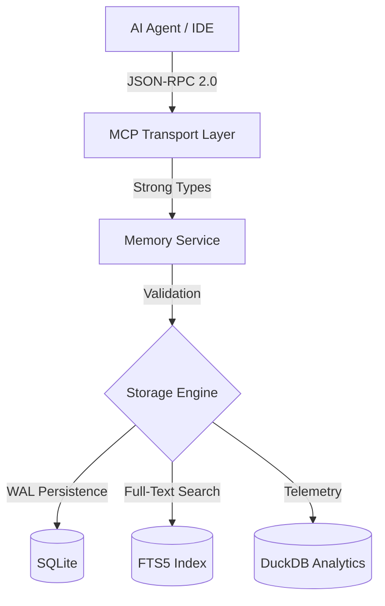

# Echo

**Echo** is a Model Context Protocol (MCP) server designed to provide AI agents with a persistent, contextual "brain." By bridging the gap between stateless AI reasoning and local filesystem persistence, Echo allows your AI agent to store and recall architectural preferences, project-specific snippets, and frequent instructions in a local SQLite database.

Unlike standard LLM sessions that reset context every time the process exits, Echo creates a long-term memory (LTM) layer. This ensures that established project preferences and instructions are automatically inherited by the AI in all future sessions, across any directory on your machine.

🌐 [Project Portal](https://victoriacheng15.github.io/echo/)

📚 [Documentation Hub: Architecture, ADRs & Operations](./docs/README.md)

---

## 📚 Project Evolution

This platform evolved through intentional phases. See the full journey with ADRs:

[View Complete Evolution Log](docs/README.md)

### Key Milestones

- **Ch 1: Persistence** – SQLite with WAL mode for high-concurrency tool calls.
- **Ch 2: Performance** – FTS5 Inverted Index for $O(\log n)$ keyword search (230x faster).
- **Ch 3: Workflow** – Custom Go-based static generator for living architectural documentation.
- **Ch 4: Analytics** – DuckDB integration for knowledge ROI and autonomous memory refinement.

Each milestone links to Architecture Decision Records (ADRs) showing the *why* behind each change.

---

## 🛠️ Tech Stack & Architecture

The platform leverages a robust set of modern technologies for its core functions:


### System Architecture Overview

The diagram below illustrates the high-level flow of memory data from AI agent requests to persistent storage and optimized retrieval.



---

## 🚀 Key Achievements & Capabilities

### 🧠 Persistent Software Architecture

- **Contextual Recall:** Automatically partitions memories into `project:<name>` and `global` scopes for precision retrieval based on the active workspace.
- **XDG Compliance:** Strictly adheres to Linux standards by storing the "brain" in `~/.local/share/echo/`, ensuring LTM survives binary updates.
- **Architectural Isolation:** Implemented "Thin Main" patterns to decouple MCP transport logic from the core business services.

### ⚡ Operational Performance

- **Sub-Millisecond Search:** Utilizes FTS5 virtual tables to ensure the AI's reasoning loop is never throttled by I/O during heavy context retrieval.
- **Atomic Integrity:** Guarantees data consistency via SQLite transactions and Write-Ahead Logging (WAL), even during catastrophic process exits.
- **Zero-Config Analytics:** Leverages DuckDB to generate usage insights without requiring external database infrastructure or complex setup.

### 🛡️ Engineering Standards

- **Contract Enforcement:** Validates memory payloads against strict JSON schemas and 8KB content limits to prevent context bloat.
- **Reproducible Runtimes:** Leverages **Nix** flakes to ensure the CGO-linked SQLite environment is identical across all developer machines.
- **Decision Framework:** Adopted Architectural Decision Records (ADRs) to document system evolution and manage technical design debt.

---

## 🚀 Getting Started

<details>
<summary><b>Operational Guide</b></summary>

This guide will help you set up, configure, and verify the Echo MCP server.

### Prerequisites

Ensure you have the following installed on your system:

- [Go](https://go.dev/doc/install) (1.25+)
- [Nix](https://nixos.org/download.html) (optional, for reproducible toolchains)
- `make` (GNU Make)
- `sqlite3` CLI (for manual audits)

### 1. Build and Install

Echo requires CGO for SQLite support. Use the provided Makefile for a guaranteed build:

```bash
# Build the binary (using Nix recommended)
nix develop -c make build

# Manual build
make build

# Install to ~/.local/bin/echo
make install
```

### 2. Configuration

Add Echo to your Gemini CLI configuration (usually `~/.gemini/settings.json`):

```json
{
  "mcpServers": {
    "echo": {
      "command": "/home/[user]/.local/bin/echo",
      "args": ["--db", "/home/[user]/.local/share/echo/echo.db"]
    }
  }
}
```

### 3. Verification & Observability

Once installed, you can verify performance and audit the "brain" directly:

- **Performance Audit**

```bash
make bench
```

- **Direct Database Access**

```bash
# View the last 5 things the AI learned
sqlite3 ~/.local/share/echo/echo.db "SELECT * FROM memories ORDER BY last_used DESC LIMIT 5;"
```

### 4. Testing

Maintain high operational standards by running the full test suite:

```bash
# Run all tests
make test

# Generate coverage report
make test-cov
```

</details>
