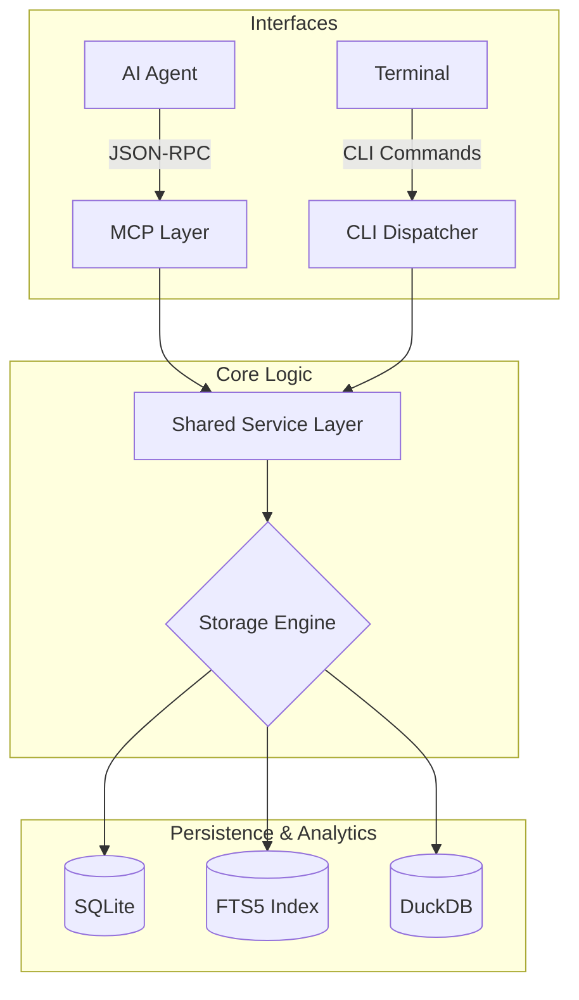

# Echo

## What is this?

Echo is a local persistent memory system for AI agents and developers.

It solves a key problem with LLMs:
- they forget everything between sessions

Echo adds a “long-term memory layer” so both:
- AI agents (via MCP)
- humans (via CLI)

can store, search, and reuse knowledge across sessions.

🌐 [Project Portal](https://victoriacheng15.github.io/echo/)  
📚 [Full Documentation](./docs/README.md)

---

## 🎥 Demo

- MCP Server (AI Agent Interface): https://youtu.be/teT9FgH5s4I  
- CLI Interface (Human Usage): https://youtu.be/R9kg8Toc9no  

---

## 🔍 What I Built (Quick Proof)

- Persistent memory layer using SQLite (local database)
- Dual interface:
  - MCP server for AI agents
  - CLI tool for human interaction
- Fast keyword search using FTS5 indexing
- Context-aware memory (project-specific + global scope)
- Analytics layer using DuckDB
- Reproducible environment using Nix
- Strong validation using JSON schemas
- High-performance design (sub-millisecond queries)
- Fully local and privacy-first (no external services)

---

## 📦 Platform Projects

This system is built as a collection of smaller systems:

1. **Persistent Memory Engine**
   - SQLite-based storage with WAL for reliability

2. **AI Agent Interface (MCP Server)**
   - JSON-RPC interface for AI tool integration

3. **CLI Interface**
   - Command-line tool for storing and querying memory

4. **Search Engine**
   - FTS5 full-text indexing for fast lookup

5. **Context Management System**
   - Project-based and global memory separation

6. **Analytics Engine**
   - DuckDB for usage insights and memory optimization

7. **Validation Layer**
   - Schema-based validation for memory entries

8. **Reproducible Environment**
   - Nix-based setup for consistent builds

9. **Documentation Engine**
   - Static generator for architecture and ADRs

10. **Performance Optimization**
   - Designed for low-latency AI interaction loops

---

## 🧠 Problems I Solved

- LLMs lose context → added persistent memory layer
- Slow retrieval → optimized search with FTS5 indexing
- Memory collisions → introduced structured IDs and contexts
- Lack of control → added CLI for manual memory management
- External dependency risk → built fully local system
- Hard to analyze usage → added DuckDB analytics layer

---

## 🛠️ Tech Stack

**Core**
- Go
- SQLite (WAL mode)
- FTS5 (full-text search)

**Analytics**
- DuckDB

**Dev Environment**
- Nix

**Interfaces**
- MCP (JSON-RPC)
- CLI

---

## 🏗️ System Architecture


```mermaid
graph TD
    subgraph "Interfaces"
        A[AI Agent] -- "JSON-RPC" --> B[MCP Layer]
        H[Terminal] -- "CLI Commands" --> I[CLI Dispatcher]
    end

    subgraph "Core Logic"
        B --> C[Shared Service Layer]
        I --> C
        C --> D{Storage Engine}
    end

    subgraph "Persistence & Analytics"
        D --> E[(SQLite)]
        D --> F[(FTS5 Index)]
        D --> G[(DuckDB)]
    end
```

---

## 🔎 Example: Memory Flow

### Store Memory
- User or AI sends content
- System validates input
- Memory stored in SQLite

### Recall Memory
- Query executed using FTS5 index
- Relevant results returned instantly

---

## ⚠️ Challenges

I anticipated search performance issues as the dataset grows.

I wrote benchmarks simulating ~1,000 records and found linear scans would not scale well.

I implemented SQLite FTS5 indexing to ensure efficient search performance.

---

## 🚀 Getting Started

<details>
<summary><b>Setup</b></summary>

```bash
make build
make install
```

</details>

---

## 📌 Summary

This project demonstrates how to build a persistent memory system for AI using:

- local-first architecture (SQLite)
- fast search indexing (FTS5)
- dual interfaces (MCP + CLI)
- analytics with DuckDB
- reproducible environments (Nix)

It shows how to extend stateless AI systems with long-term memory and structured context.
