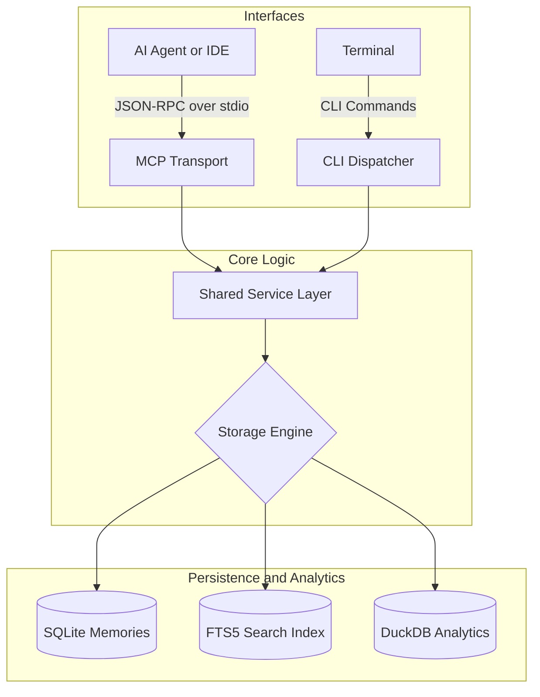

# Echo

Echo is a local persistent memory system for AI agents and developers, built in Go with SQLite, FTS5, DuckDB, and the Model Context Protocol. It gives stateless LLM sessions a durable memory layer that can be queried by an AI host over MCP or managed directly from a terminal.

The project focuses on fast local recall, explicit memory governance, and safe human-in-the-loop maintenance. Memories are stored locally, scoped by context, indexed for keyword search, and exposed through both a JSON-RPC MCP server and a CLI.

[Project Portal](https://victoriacheng15.github.io/echo/) | [Full Documentation](./docs/README.md)

---

## Highlights

| Area | What it demonstrates |
| :--- | :--- |
| Persistent memory | SQLite stores durable memories with context keys, entry types, tags, source attribution, and reinforcement through UPSERTs. |
| AI integration | The MCP server exposes store, recall, search, update, deletion, and analytics tools for agent workflows. |
| Human control | The CLI supports store, recall, search, delete, maintenance, and table, JSON, or CSV output formats. |
| Search performance | SQLite FTS5 indexes memory content for keyword search, with a short-query fallback for substring matching. |
| Safety | Destructive operations use an ID-based retrieve, confirm, act flow to avoid accidental deletion by ambiguous content. |
| Analytics | Telemetry can be written to JSONL and synchronized into DuckDB for context-level usage, cost, hit-rate, and carbon estimates. |

---

## Architecture

Echo uses a dual-interface architecture. The CLI and MCP transport layer share the same service and persistence code, so AI-driven and human-driven workflows operate on the same local data model.

| Path | Use case | Flow |
| :--- | :--- | :--- |
| MCP path | AI agent stores or retrieves memory | Agent host -> JSON-RPC over stdio -> MCP tools -> service layer -> SQLite and FTS5 |
| CLI path | Human reviews or curates memory | Terminal command -> CLI dispatcher -> service layer -> SQLite and FTS5 |
| Analytics path | Usage analysis and memory tuning | Telemetry JSONL -> DuckDB sync -> context-level analytics |


```mermaid
graph TD
    subgraph "Interfaces"
        A[AI Agent or IDE] -- "JSON-RPC over stdio" --> B[MCP Transport]
        H[Terminal] -- "CLI Commands" --> I[CLI Dispatcher]
    end

    subgraph "Core Logic"
        B --> C[Shared Service Layer]
        I --> C
        C --> D{Storage Engine}
    end

    subgraph "Persistence and Analytics"
        D --> E[(SQLite Memories)]
        D --> F[(FTS5 Search Index)]
        D --> G[(DuckDB Analytics)]
    end
```

---

## Tech Stack

| Layer | Tools |
| :--- | :--- |
| Language | Go |
| Data stores | SQLite, FTS5, DuckDB, JSONL telemetry log |
| Observability | Memory telemetry events, DuckDB analytics views, benchmark suite |
| Testing | Go `testing` package, table-driven tests |
| CI/CD | GitHub Actions |

---

## Documentation

- [Full Documentation](./docs/README.md)
- [Architecture](./docs/architecture.md)
- [Decision Records](./docs/decisions/README.md)

---

## Demos

- [MCP Server: AI Agent Interface](https://youtu.be/teT9FgH5s4I)
- [CLI Interface: Human Usage](https://youtu.be/R9kg8Toc9no)

---

## Local Setup

Build and verify the project:

```bash
make build
make test
make bench
```

Install the CLI:

```bash
make install
```

Use the CLI directly:

```bash
echo-cli store -content "Use FTS5 for memory search." -context project:echo -type directive -tags search,sqlite
echo-cli recall -contexts global,project:echo -limit 10
echo-cli search -query FTS5
echo-cli maintain -rebuild
```

Run the binary as an MCP server by launching it from an MCP host with stdin connected to the JSON-RPC transport. When no CLI subcommand is provided and stdin is not a terminal, Echo starts the MCP server automatically.
