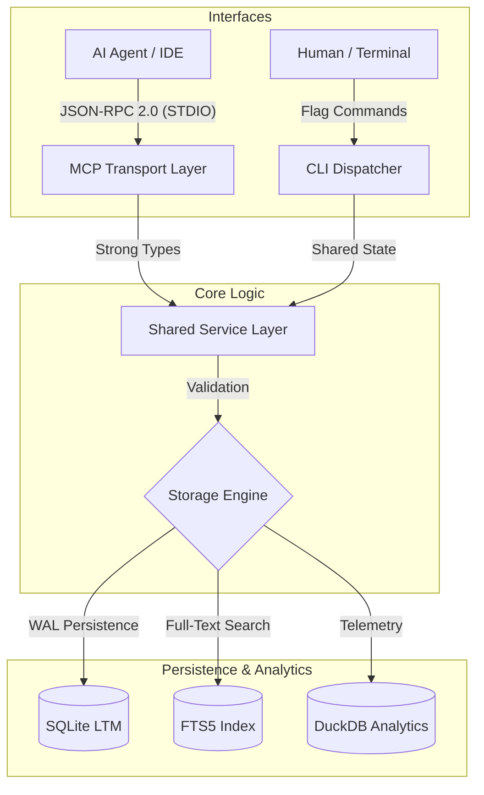

# System Architecture

The Echo system is a Dual-Interface Application designed with a strict separation of concerns. This architecture ensures that core business logic and persistence layers are entirely decoupled from the interface protocols, allowing for simultaneous support of AI-driven MCP interactions and manual terminal-based curation.

## High-Level Data Flow

## Core Components

### 1. Interface Layer (`cmd/echo`)

- **Multiplexing**: Implements "Fat Binary" patterns to reduce deployment complexity.
- **Smart TTY Routing**: Automatically starts the MCP server when standard input is not a terminal (AI host) and provides an interactive CLI when standard input is a terminal (Human).
- **Service Injection**: Handles the initialization and dependency injection of all shared services.

### 2. CLI Dispatcher (`internal/cli`)

- **Subcommand Routing**: Manages the lifecycle of `store`, `recall`, `search`, `delete`, and `maintain` commands.
- **Multi-Format Rendering**: Supports `table`, `json`, and `csv` output formats to accommodate both human readability and automated data pipelines.
- **Maintenance Operations**: Provides direct administrative control over FTS5 index rebuilding and DuckDB analytical synchronization.

### 3. MCP Transport Layer (`internal/mcp`)

- **Tool Registration**: Exposes the shared service layer to AI agents via standard MCP tool definitions.
- **Contract Enforcement**: Maps raw JSON arguments to strong Go types, ensuring strict adherence to the memory governance rules.

## Surgical Operations & Safety

To prevent accidental data loss and ensure deterministic state control, Echo employs a **"Retrieve -> Confirm -> Act"** safety protocol for all destructive or surgical modifications:

1. **Discovery (Search)**: The AI agent uses `search_memories` or `search_for_deletion` to identify the target record and retrieve its unique surrogate `id`.
2. **User Confirmation**: The agent MUST present the specific memory to the user for explicit confirmation. This acts as a human-in-the-loop guardrail.
3. **Deterministic Execution**: Only after confirmation does the agent call `update_memory` or `delete_memory` using the immutable `id`. This eliminates the risk of "mass-deletion" caused by content collisions where multiple identical or similar records might exist across different contexts.

## Core Components (Logic & Persistence)

### 2. Business Logic (`internal/service`)

- **`MemoryService`**: The core application logic. It holds no knowledge of the MCP protocol.
- **Hybrid Search**: Implements the logic to route short queries (< 3 chars) to a `LIKE` scan and longer queries to the FTS5 index.
- **Validation**: Enforces strict data contracts (`entry_type` enums, valid JSON metadata) to ensure the AI does not corrupt the "brain".

### 3. Persistence Layer (`internal/db`)

- **SQLite Engine**: Configured with `_journal_mode=WAL` for high concurrency.
- **Primary Table (`memories`)**: The source of truth. Uses a composite index (`idx_context_relevance`) for sub-millisecond contextual recall.
- **FTS5 Virtual Table (`memories_fts`)**: An inverted index synchronized via `AFTER` triggers to provide $O(\log n)$ keyword search performance.

## Performance

Echo is designed with performance in mind (P99 < 10ms) to ensure it does not bottleneck AI reasoning loops.

The following benchmarks were recorded on the machine below:

- **CPU:** AMD Ryzen 7 7840HS (8C/16T) @ 3.8GHz
- **Storage:** NVMe SSD

### Current Performance (1,000+ Records)

By leveraging an FTS5 inverted index and optimized composite indexing, Echo achieves sub-millisecond latency for all read operations.

| Operation | Complexity | Latency (ms) | Note |
| :--- | :--- | :--- | :--- |
| **Recall** | $O(\log n)$ | **0.12 ms** | Indexed via `idx_context_relevance` |
| **Search** | $O(\log n)$ | **0.63 ms** | FTS5 Inverted Index |
| **Store** | $O(1)$ | **0.16 ms** | SQLite WAL UPSERT |
| **Delete** | $O(1)$ | **0.12 ms** | Record removal & FTS5 sync |

These metrics are formally verified via the Go benchmarking suite (`make bench`).
